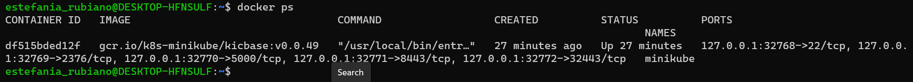
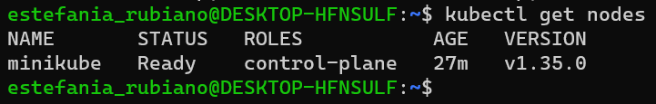

# Week 1 - Deliverable

## Estefania Rubiano

## 🎯 Objetivo profesional 
*Quiero crecer como desarrolladora explorando distintas disciplinas: backend, frontend, cloud... Hasta encontrar el área donde más disfrute y aporte :)*

## 📘 3 cosas que aprendí esta semana
1. He aprendido a desplegar un servidor nginx en Kubernetes y a acceder a él mediante Minikube.
2. Ya entiendo cómo funcionan los deployments, los pods y los services dentro de un cluster.
3. He configurado mi entorno en WSL para poder usar Docker y Kubernetes sin errores.

## 🐳 Salida de `docker ps`

## ☸️ Salida de `kubectl get nodes`

